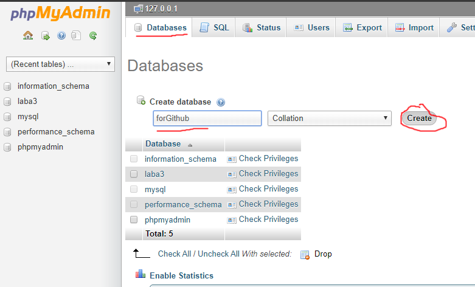
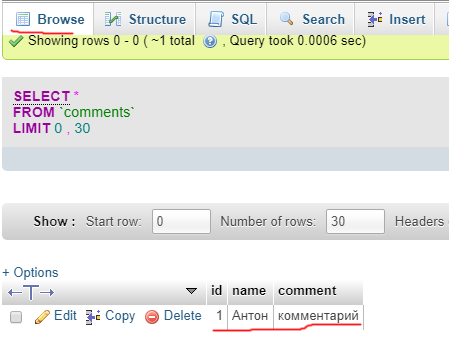

# Как работать с базами данных в php

1. Запустите [denwer](how_to_start_php.md) и проверьте, не удалина ли папка Tools из вашего каталога localhost.  
Как правило, эта папка располагается по следующему пути: `Z:\home\localhost\www\Tools`. Если данная папка отсутсвует, скачайте ее по [ссылке](https://yadi.sk/d/3Tp44nGyAJUqog) и поместите по вышеуказанному пути. В данной папке находится phpmyadmin - панель управления базами данных.  

2. Откройте в браузере адресс [localhost/tools/phpmyadmin/](http://localhost/tools/phpmyadmin/). Вы увидете панель для упрвления базами данных.  
Нажмите в верхнем меню на копку `Databases` и создайте новую БД.  
__!!!__ В любых названиях рекомендую использовать только буквы английского алфавита и цифры. __!!!__
  

3. После создания базы данных, выберите ее в списке всех баз, который находится слева.  
Вас попросят ввести название таблицы и количество столбцов. Я буду использовать 3 столбца: __id__, __name__, __comment__.  

4. После создания таблицы, необходимо ее настроить. В открышемся окне phpmyadmin предлагает выбрать тип для каждой колонки и задать нужные параметры.  
для поля __id__ задаем тип `INT` и ставим галочку `A_I`  
для остальных полей я задам тип `TEXT` и выберу кодировку `cp1251_bin` (это необходимо т.к. наши php скрипты отправляют данные в кодировке windows1251).  
  

5. Создание базы данных и настройка таблицы закончена. Теперь перейдем к написанию php скрипта, отправляющего запросы в бд.  
``` php
<?php

// Переменные для соединения с базой данных
$hostname = "localhost"; // Адресс бд. У вас будет также
$username = "root"; // Имя пользователя. У вас тоже root
$password = ""; // root по умолчанию без пароля
$dbName = "forgithub"; // Название таблицы

// создать соединение
mysql_connect($hostname, $username, $password);

// выбрать базу данных
mysql_select_db($dbName);

// Выполнить запрос
$result = mysql_query("INSERT INTO comments (name,comment)
VALUES ('Антон', 'комментарий');");
/*
Данный запрос запишет информаицю в таблицу comments.
'Антон' запишется в поле name
'комментарий' запишется в поле comment
*/


// Закрываем соединение
mysql_close();
?>
```  


6. Для того, чтобы связать данный скрипт с прошлой лабараторной, необходимо изменить параметр метода `mysql_query`.  
Как вы помните, в прошлой лабараторной скрипт принимал post запросы, поэтому новый запрос будет выглядеть как-то так:  
``` php
"INSERT INTO comments (name,comment)
VALUES ('".$_POST['name']."', '".$_POST['Comment']."');"
```  

7. Данные запросы записывают в базу данных данные. Для чтения надо будет отредактировать запрос. Надеюсь, вы справитесь с этим сами. Если нет, чуть позже дополню данную стать.